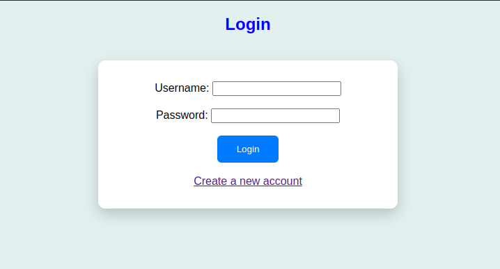
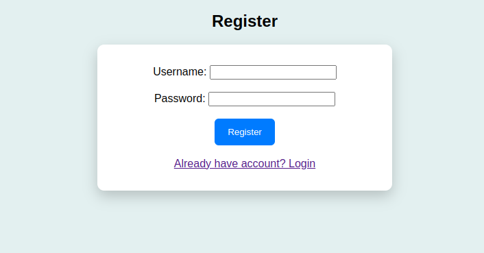
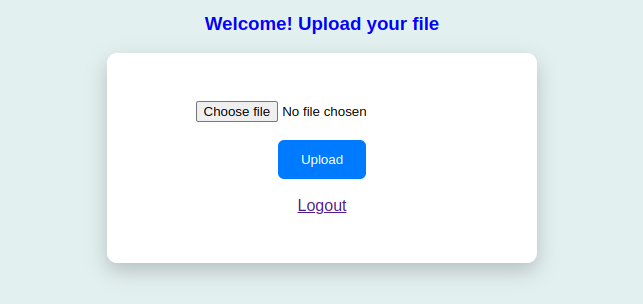

# File Upload System
## Project Description
A secure file upload system built with PHP and MySQL, which allows users to register, login, and upload files safely. The system validates file type, limits file size, sanitizes filenames, and logs all uploads for security monitoring.
## Features
- User registration and login using username and password.
- Secure file upload with:
    - Allowed file types: .jpg, .png, .pdf, .docx
    - Maximum file size: 5 MB
    - Unique file naming to prevent overwriting
- Logging of all file uploads : IP address, upload timestamp, file_status

## Technologies Used
- Backend: PHP, MySQL
- Frontend: HTML, CSS
- Database: MySQL
## Run Locally
Clone the project
```markdown

git clone https://github.com/Aiswaryav-123/File_upload_system

```
Go to the project directory
```markdown
cd File_upload_system
```
Start the server
``` marksown
php -S localhost:8000
```
# Project Demo
You can view the working output of this project here:  
[Drive Link](https://drive.google.com/file/d/1zfRszJZhS9IlIprp1s6z2wyTE-qp0uOw/view?usp=drive_link)

# Screenshots
<p align="center">
 
 
</p>
<p align="center">
  
   
</p>
